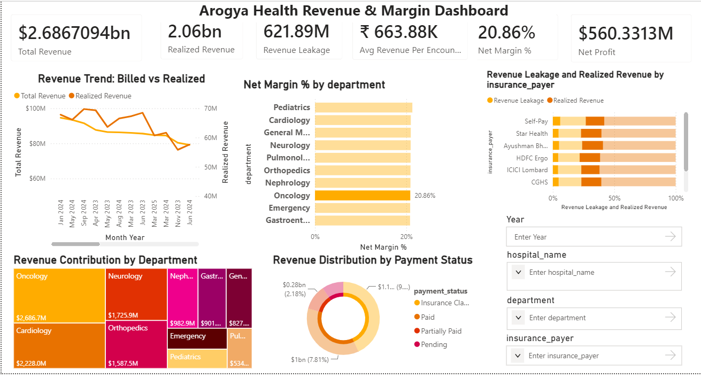

# 🏥 Arogya Health Revenue & Margin Dashboard

A Power BI dashboard developed for **Problem Statement 3 – Revenue & Margin Strategy** as part of the **Arogya Health Analytics Challenge**.

## 📌 Overview

Healthcare organizations often focus on revenue growth while overlooking profitability and collection efficiency. This project analyzes Arogya Health's financial performance to uncover where revenue is generated, where margins are lost, and how much billed revenue is actually realized.

The dashboard provides a CFO-level view of revenue, profitability, and revenue leakage across hospitals, departments, and insurance payers.

---

## 🎯 Business Problem

As a Financial Strategy Analyst advising the **Chief Financial Officer (CFO)**, the objective was to answer:

> **Where does Arogya actually make and lose money, and which revenue are we booking but failing to collect?**

The dashboard helps identify:

* High-revenue departments
* High-margin service lines
* Revenue leakage sources
* Collection efficiency issues
* Insurance payer performance

---

## 📷 Dashboard Preview



---

## 🚀 Features

### Financial Performance Analysis

* Total Revenue Tracking
* Revenue Trend Analysis
* Net Profit Monitoring
* Net Margin Evaluation

### Revenue Realization Analysis

* Realized Revenue Tracking
* Revenue Leakage Identification
* Collection Efficiency Monitoring
* Payment Status Breakdown

### Department Performance Analysis

* Revenue Contribution by Department
* Profitability Comparison
* High Margin vs Low Margin Service Lines

### Payer Analysis

* Insurance Payer Performance
* Revenue Realization by Payer
* Collection Risk Identification

### Interactive Filtering

* Year Filter
* Hospital Filter
* Department Filter
* Insurance Payer Filter

---

## 📊 Key Performance Indicators (KPIs)

### Revenue Metrics

* Total Revenue
* Realized Revenue
* Revenue Leakage
* Average Revenue per Encounter

### Profitability Metrics

* Net Profit
* Net Margin %

### Collection Metrics

* Revenue Realization %
* Collection Efficiency %

---

## 📈 Dashboard Components

### 1. Executive KPI Cards

Provides a quick overview of:

* Total Revenue
* Realized Revenue
* Revenue Leakage
* Net Profit
* Net Margin %
* Average Revenue per Encounter

### 2. Revenue Trend Analysis

**Line Chart**

Tracks:

* Billed Revenue
* Realized Revenue

Purpose:

* Understand revenue growth trends
* Compare revenue generated vs revenue collected

### 3. Revenue Contribution Analysis

**Treemap**

Shows:

* Revenue contribution by department

Purpose:

* Identify major revenue-generating departments
* Analyze revenue concentration

### 4. Department Profitability Analysis

**Bar Chart**

Shows:

* Net Margin % by Department

Purpose:

* Identify profitable departments
* Detect margin leakage

### 5. Revenue Realization by Payer

**Stacked Bar Chart**

Shows:

* Realized Revenue
* Revenue Leakage

Purpose:

* Identify problematic payer segments
* Analyze collection efficiency

### 6. Payment Status Distribution

**Donut Chart**

Displays:

* Paid
* Partially Paid
* Pending
* Insurance Claimed

Purpose:

* Evaluate revenue realization performance

---

## 🧮 DAX Measures Created

### Revenue Measures

```DAX
Total Revenue
Total Cost
Net Profit
Net Margin %
Total Encounters
Avg Revenue Per Encounter
```

### Collection Measures

```DAX
Realized Revenue
Revenue Realization %
Revenue Leakage
Collection Efficiency %
```

---

## 🏗 Data Model

The dashboard follows a **Star Schema** architecture.

### Fact Table

* Encounters

### Dimension Tables

* Patients
* Hospitals
* Doctors
* Date Table

This structure improves performance and simplifies analysis.

---

## 🛠 Tools & Technologies

* Microsoft Power BI
* DAX (Data Analysis Expressions)
* Data Modeling
* Star Schema Design
* Interactive Visualizations

---

## 📂 Dataset Overview

The dataset contains:

| Dataset    | Records |
| ---------- | ------- |
| Encounters | 50,000+ |
| Patients   | 18,000+ |
| Hospitals  | 15      |
| Doctors    | 320     |

Period Covered:

**2023 – 2025**

---

## 💡 Key Insights

* Revenue alone does not indicate profitability.
* High-revenue departments may operate on lower margins.
* A significant portion of billed revenue remains unrealized.
* Collection efficiency varies across insurance payers.
* Revenue leakage directly impacts overall profitability.

---

## 🔮 Future Enhancements

* Revenue Forecasting
* Drill-Through Analysis
* Executive Summary Page
* Dynamic KPI Selection
* AI-Driven Financial Insights
* Advanced Financial Benchmarking

---

## 👨‍💻 Author

### Akarsh Anubhav

B.Tech – Computer Science Engineering (Big Data Analytics)

SRM Institute of Science and Technology

#### Connect With Me

* GitHub: https://github.com/akarshCpp
* Instagram: https://www.instagram.com/_akarsh_xd/

---

⭐ If you found this project useful, consider giving the repository a star!
